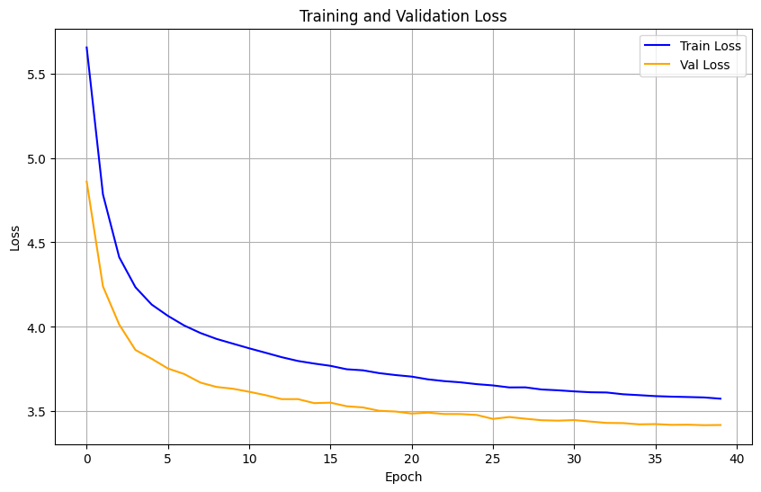

# Chees
Задание заключалось в предсказание следующий ходов для любой возможной позиции. Дается таблица с положением фигур на доске в формете FEN и сделанный ход.

## Результат предсказаний

[](result/prediction_plot.jpg)

## Метод решения
 1. Подготовка данных:

- Парсинг FEN: разделение по цветам, определение возможных рокировок, поля для взятия на проходе, счётчика полуходов и номера хода.

- Разделение на признаки и представление фигур в удобном формате для нейросети.
 2. Созданы словари для кодирования: ход - индекс и индекс - ход для многоклассовой классификации.
 3. Разделение данных
- Обучающая, валидационная и тестовая выборки.

- Преобразование данных в PyTorch тензоры.
 4. Разработана нейросеть для решения задачи многоклассовой классификации следующего хода.
 5. Модель обучена на подготовленных данных. Выполнены предсказания и рассчитаны метрики: Accuracy, Precision, Recall, Top-5 Accuracy.


## Итоги эксперимента
Была решена задача многоклассовой классификации следующего хода в шахматах.

Полученные метрики:

Accuracy: 0.29

Precision: 0.17

Recall: 0.29

Top-5 Accuracy = 0.50, что означает:
в 50% случаев правильный ход присутствует среди пяти наиболее вероятных вариантов, предсказанных моделью.

Низкие значения точности и полноты объясняются большим количеством возможных ходов (сильная многоклассовость). Несмотря на это, модель достаточно часто включает верный ход в топ-5 предсказаний, что является хорошим результатом для подобной задачи.


## Запуск программы
1.  Клонируйте репозиторий:
    ```bash
    git clone https://github.com/KarinaCreate/Chees
    cd Nonlinear-regression
    ```

2.  Установите зависимости:
    ```bash
    pip install -r requirements.txt
    ```

3.  Запустите решение:
    ```bash
    python Chees.ipynb
    ```
